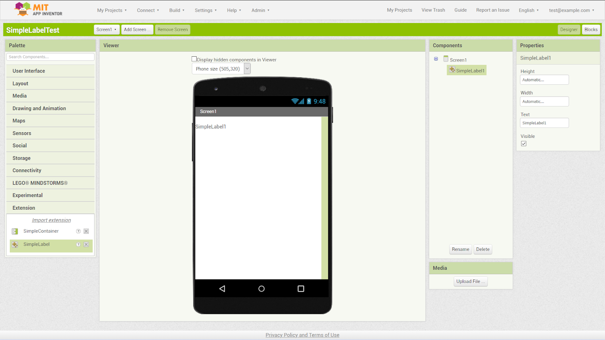
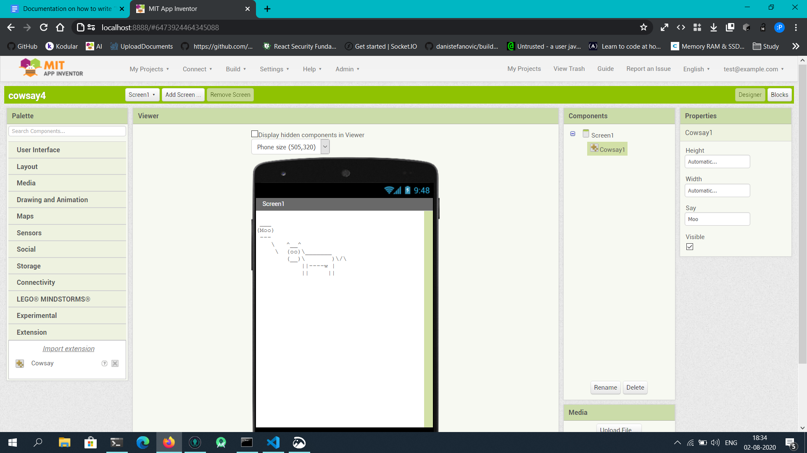

[](https://summerofcode.withgoogle.com/projects/#4749864480538624) [](https://docs.google.com/document/d/14FwGfVMQcyDReeWCPSqFbMWSbW6ZsYbl3mRBsPEzBnQ/edit?usp=sharing) [](https://docs.google.com/document/d/1BV1lGCNtYjP0H0dxUyLcVPnO91ztke-1VAH4EnRdDYc/edit?usp=sharing) [](https://docs.google.com/document/d/17uMiZ5RuwC3u9J1e2oVUIGNPVHA8Mp2umDka6pXJ244/edit?usp=sharing)

# About the Project
A Visible Component Extension or VCE is a type of extension which is able to provide Mock preview of what a component running on a real device would like. It leverages the existing mechanism set in place to write Mocks for the internal components. The goal of this to make VCE look and feel similar to a regular visible component, and provide a safe and secure way of getting a VCE running in the browser.

# Background

### About Me
My name is [Pavitra Golchha](https://pavi2410.me). I'm a CSE student. I live in india. I'm passionate about computers and programming. I love my weapons - Kotlin, JavaScript, Python. I like to play badminton, listen to music and learn new stuffs.

### About MIT App Inventor 
[App Inventor](https://appinventor.mit.edu/images/logo.png) is a web-based Android app maker. It allows anyone to create an app without any prior coding knowledge. It features a drag-and-drop UI designer, and a Blocks editor. It is mostly a learning tool that introduces one to computer science and programming concepts using its blocks model, based on [Blockly](https://developers.google.com/blockly/). It empowers students to turn their ideas into reality as it did for me :)

### My Experience with MIT App Inventor Open Source Project
I am an App Inventor user since 2015, an extension dev and an open source contributor. I was already involved with this organisation which has helped me in a lot of ways - I knew the people in the team, know how the project and most of the code works. I am thankful to them for accepting my proposal.

## My Mentors
Susan and Evan helped me a lot. They are very knowledgeable, friendly and supportive. They helped me with every big and small problems I faced. I am very fortunate to have them as my mentors.

### My Exterience with Google Summer of Code 2020
The 3-month long journey has suddenly felt short :( I enjoyed working for the organisation of my choice. I am very grateful to have this opportunity. 

# My contributions
- [PR #2223 @ mit-cml/appinventor-sources](https://github.com/mit-cml/appinventor-sources/pull/2223)
- [Branch with the new iFrame-based sandbox implementation](https://github.com/pavi2410/appinventor-sources/tree/mvce3) 
  - Start commit: [Added BuildTools](https://github.com/mit-cml/appinventor-sources/commit/61541e0c5a41f693005369a1a74f404e5aef0c02)
  - Last commit: [JUST MADE THIS WORK UP AND RUNNING](https://github.com/mit-cml/appinventor-sources/commit/30a3e1b2a0dbe7ecc5544d90fc07d42e2bcb1b91)
- [iFrame-based VCE SDK](https://gist.github.com/pavi2410/18195e3e6096aa257aa0341524d0da9e)

# Sample Extensions I made for testing
- [SimpleLabel](https://github.com/pavi2410/vce-samples/tree/simplelabel) - mimicks the built-in Label component
  - Mock code
    ```js
    class MockSimpleLabel extends MockVisibleExtension {
      static TYPE = "com.pavi2410.SimpleLabel"

      constructor(uuid) {
        super(MockSimpleLabel.TYPE, uuid)
        this.label = document.createElement('span')
        this.initComponent(this.label)
      }

      onCreateFromPalette() {
        this.changeProperty("Text", this.getName() || "NA");
      }

      onPropertyChange(propertyName, newValue) {
        switch (propertyName) {
          case 'Text': {
            this.el.innerText = newValue
            break
          }
        }

        super.onPropertyChange(propertyName, newValue)
      }
    }

    MockComponentRegistry.register(MockSimpleLabel.TYPE, MockSimpleLabel)
    ```
  - Demo
    
    
- [Cowsay](https://github.com/pavi2410/vce-samples/tree/cowsay) - this extension displays text said by cow; uses script element-based implementation
  - Mock code
    ```js
    class MockCowsay extends MockVisibleExtension {
      static TYPE = "Cowsay"

      constructor(editor) {
        super(editor, MockCowsay.TYPE)

        this.label = document.createElement("pre")

        this.initComponent(this.label)
      }

      onCreateFromPalette() {
        this.changeProperty("Say", "Moo")
      }

      onPropertyChange(propertyName, newValue) {
        super.onPropertyChange(propertyName, newValue)

        switch (propertyName) {
          case "Say":
            this.label.innerText = cowsay(newValue)
            break
        }
      }

      static create(editor) {
        return new MockCowsay(editor)
      }
    }

    MockComponentRegistry.register(MockCowsay.TYPE, MockCowsay.create)
    ```
  - Demo
    

# Technical Challenges
- Creating JavaScript sandbox to securely evaluate third-party extensions' Mock
  
  This was the greatest challenge of this project. I had no clue how to solve that. Upon research, I found a handful of solutions that others have developed to mitigate the same technical difficulty. But some or the other had issues of their own. So, we finally decided to build a iFrame-based sandbox system which uses browser window messages communication to allow us to talk to iFrame and let third-party Mock acuthors securely serve and run their Mock previews.

- Getting GWT to work with dynamically loaded external JavaScript code

# Future Work
- Can't create more than one instance of a VCE 
- Reloading the page causes a runtime error, making VCE implementation useless 
- Implement callback messaging system with iframe
- Mock Container support
- More and more rigorous testing.
